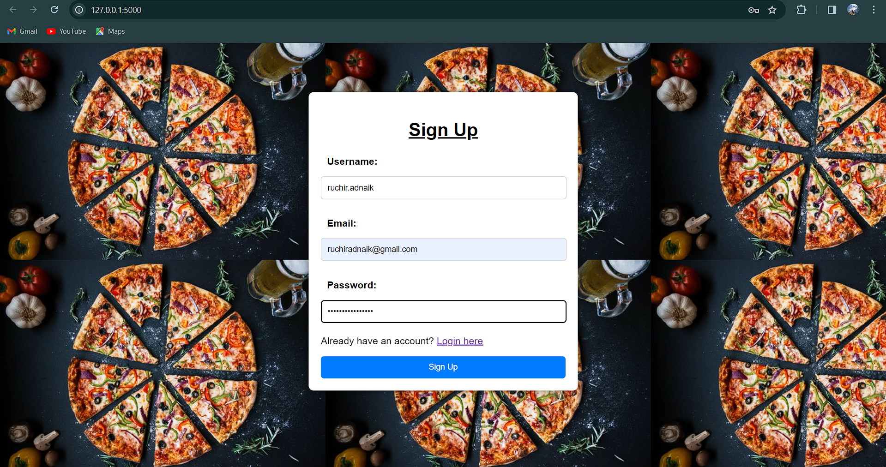
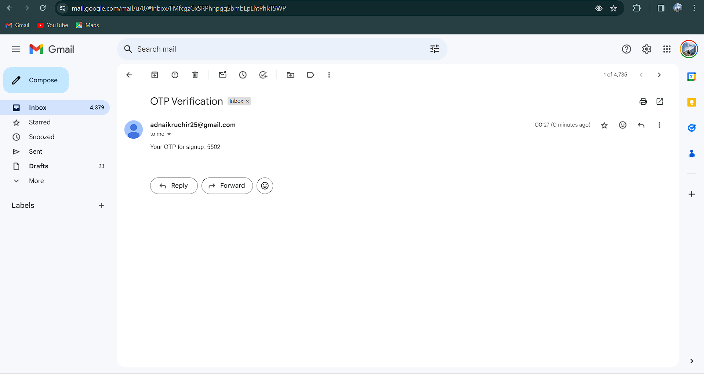
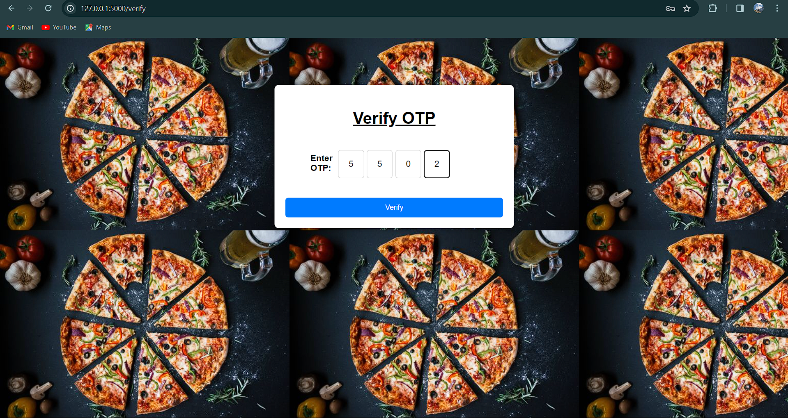
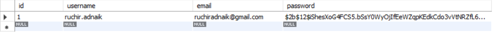
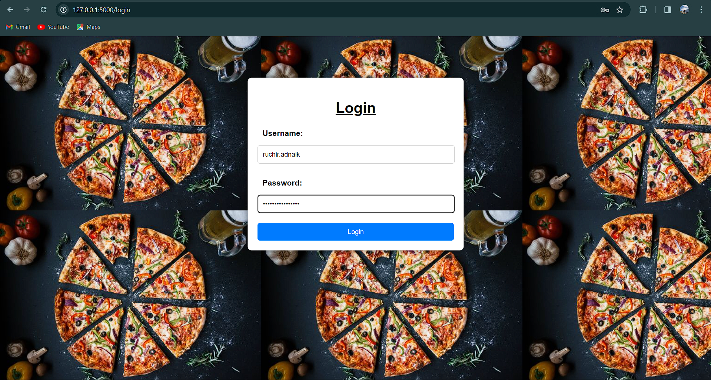
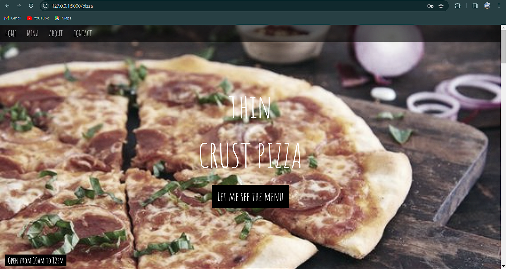
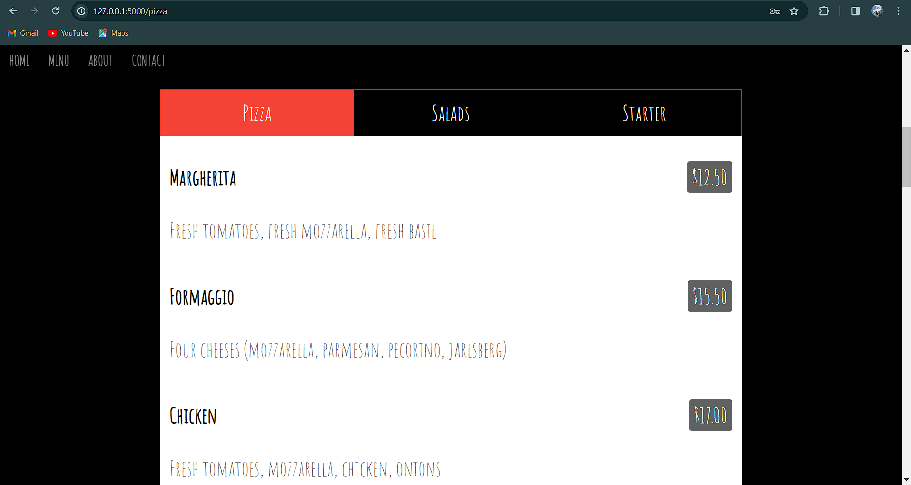
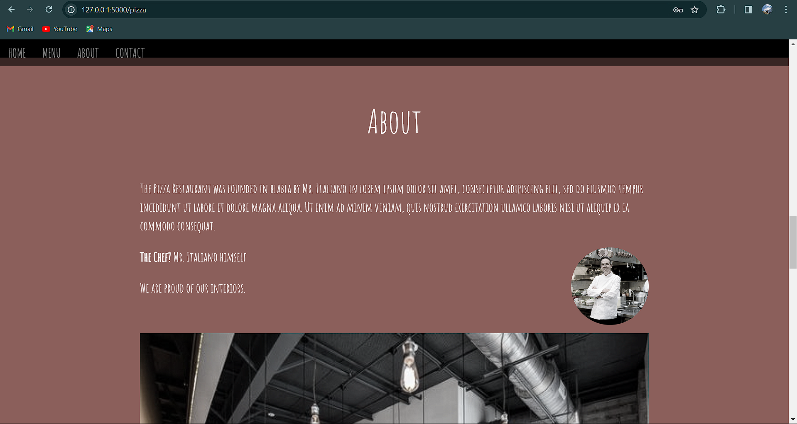
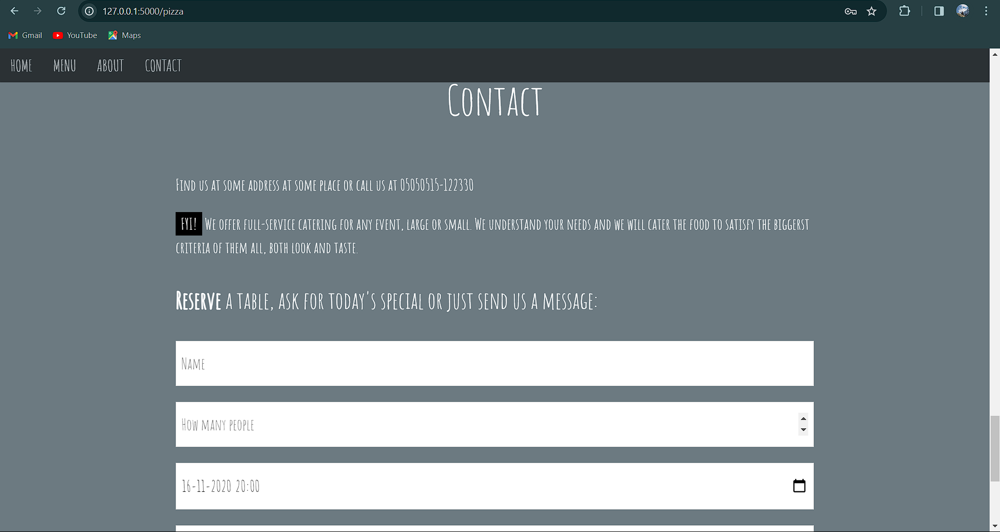

# TWO FACTOR AUTHENTICATION (2FA) SYSTEM FOR A PIZZA WEBSITE
## What is Two-Factor Authentication (2FA)?

Two-factor authentication (2FA) is a security measure that requires users to provide two different forms of verification to access a system or account. In the context of the system we've developed, the two factors are:

1. **Something You Know (Password):** This factor involves a secret password or PIN that only the user knows. It serves as the first layer of authentication.

2. **Something You Have (One-Time Password - OTP):** This factor requires something physical that the user possesses, such as a mobile device. The system generates a unique OTP and sends it to the user's registered device. The user must enter this OTP along with their password to complete the login process.

By requiring both a password and an OTP, two-factor authentication significantly enhances the security of user accounts. Even if an attacker manages to obtain the user's password, they would still need access to the user's registered device to obtain the OTP and gain unauthorized access.
This website is made to show the purpose of 2FA and how 2FA works.

## Technologies Used

The Pizza House Management System is built using a combination of technologies to provide a secure and efficient user experience:

- **Flask:** Flask, a Python micro-framework, serves as the main backend for the system. It handles routing, request handling, and business logic.

- **MySQL:** MySQL is used as the database management system to store and manage data related to users, orders, menus, and other aspects of the pizza house.

- **Flask-MySQLDB:** Flask-MySQLDB is utilized to establish a connection between the Flask application and the MySQL database, enabling seamless interaction between the backend and the database.

- **bcrypt:** To enhance security, bcrypt, a cryptographic hashing algorithm, is employed for password hashing. This ensures that passwords stored in the database are securely encrypted and protected against unauthorized access.

- **HTML and CSS:** HTML and CSS are used for the frontend development of the website. They are responsible for creating the user interface and styling the web pages to provide an appealing and intuitive user experience.

- **Data Validation with Flask:** Flask handles data validation on the server-side to ensure that incoming data is valid and meets the required criteria. This helps prevent potential security vulnerabilities and ensures data integrity within the system.

By leveraging these technologies, the Pizza House Management System offers a robust, secure, and user-friendly solution for managing a pizza house's operations effectively.

## Installation Instructions

2. **Install Dependencies:**
- Make sure you have Python and pip installed on your system.
- Install the required Python packages using pip:
  ```
  pip install Flask Flask-Mail Flask-MySQLDB bcrypt bleach
  ```

3. **Database Setup:**
- Set up a MySQL database server (e.g., using XAMPP, WAMP, or MAMP).
- Create a new database named `user_database`.
- Update the MySQL configuration in the `app.py` file with your database credentials:
  ```python
  app.config['MYSQL_HOST'] = '127.0.0.1'
  app.config['MYSQL_USER'] = 'root'
  app.config['MYSQL_PASSWORD'] = 'your-mysql-password'
  app.config['MYSQL_DB'] = 'user_database'
  ```

4. **Run the Application:**
- Run the Flask application:
  ```
  python app.py
  ```
- Access the application in your web browser at `http://localhost:5000`.

## Usage

1. **Signup:**
- Navigate to the signup page (`/signup`).
- Enter your desired username, email, and password.
- An OTP (One-Time Password) will be sent to your email for verification.

2. **Verify OTP:**
- Enter the OTP received on your email to verify your account.
- Upon successful verification, proceed to login.

3. **Login:**
- Access the login page (`/login`) and enter your username and password.
- If credentials are correct, you will be redirected to the pizza site.

4. **Place Orders:**
- Once logged in, you can access the pizza site (`/pizza`) to view the menu and place orders.
- Enjoy exploring the Pizza House Management System!


## Contributing

Contributions to the Pizza House Management System are welcome! Here's how you can contribute:

- **Reporting Bugs:** If you encounter any bugs or issues, please [open an issue](https://github.com/ruchiradnaik/pizza-web/issues) on GitHub. Provide as much detail as possible, including steps to reproduce the issue.

- **Requesting Features:** If you have ideas for new features or improvements, feel free to [open an issue](https://github.com/ruchiradnaik/pizza-web/issues) to suggest them.

- **Submitting Pull Requests:** If you'd like to contribute directly to the codebase, you can fork the repository, make your changes, and submit a pull request. Please ensure that your code follows the project's coding standards and include tests where applicable.

## License

This project is licensed under the [MIT License](LICENSE). You are free to use, modify, and distribute this project in accordance with the terms of the license.

## SIGN-UP/REGISTERATION PAGE


## OTP SENT TO EMAIL


## OTP VERIFIED


## DATABASE


## LOGIN PAGE


## LOGIN SUCCESSFUL
### WELCOME TO THE PIZZA SITE






